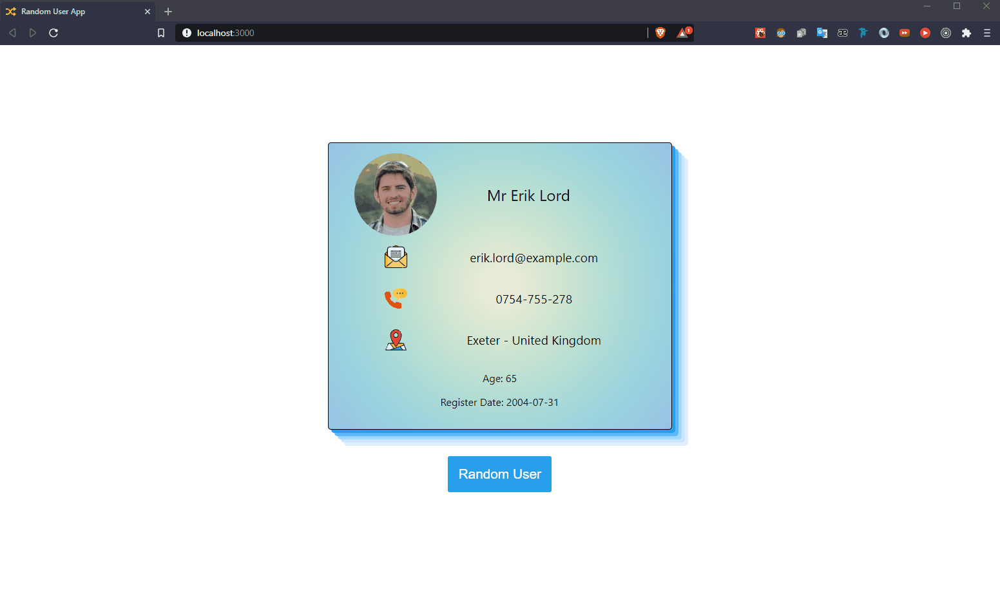

<p>Clarusway</p>

# Random User App

## Description

Project aims to create a Random User App.


## Project Skeleton

```
    Random User (folder)
|
|----readme.md   
SOLUTION
├── public
│     └── index.html
├── src
│    ├── assets
│    │       ├── email.svg
│    │       ├── location.svg
│    │       └── phone.svg
│    │
│    │
│    ├── components
│    │       ├── card
│    │       │     ├── Card.js
│    │       │     └── Card.css
│    │       │      
│    │       │       
│    │       └── svg
│    │            ├── Email.js
│    │            ├── Phone.js
│    │            └── Location.js
│    │ 
│    │ 
│    ├── App.js
│    ├── App.css
│    ├── index.js
│    └── index.css
├── package.json
└── yarn.lock
```

## Expected Outcome



## Objective

Build a Random User App using ReactJS.

### At the end of the project, following topics are to be covered;

- HTML

- CSS

- JS

- ReactJS

## Steps to Solution

- Step 1: Create React App using `npx create-react-app task-tracker`

- Step 2 : Install `"npm install axios"`

- Step 3: Build Random User App.

- Step 4: You can use CSS frameworks like Bootstrap, Semantic UI.

- Step 5: Push your application into your own public repo on Github

- Step 6: Add project gif to your project and README.md file.

## Contact

- GitHub [@iycel](https://github.com/iycel)

- Linkedin [@iycel](https://linkedin.com/in/iycel)
